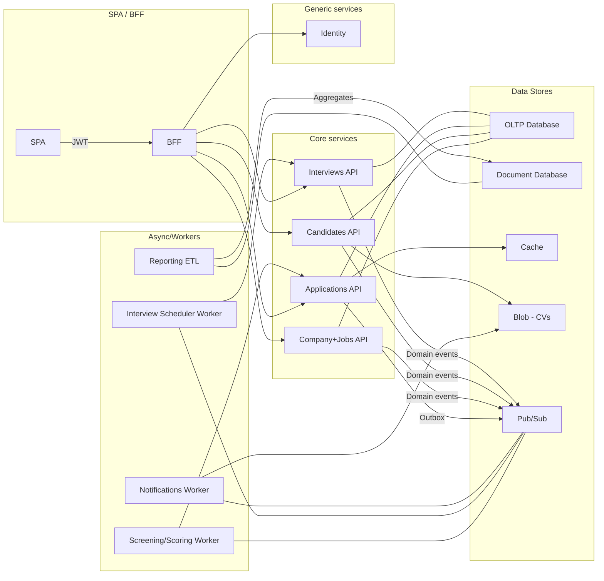

# HireFlow


## overview

A lightweight Applicant Tracking System where companies create job campaigns, publish openings, receive applications (incl. LinkedIn “apply” simulators), auto-screen, schedule interviews, and track funnel analytics.


### solution (draft)

The solution diagram below is a non-strict diagram to give us the overview of services and its responsibilities.
For now, it still a draft of desirable outcome.



### technology candidates (draft)

The candidates for implementation, for now, there is a great possibility of change. The list exists only as a roadmap.

- SPA: React Hooks
- BFF: .Net Minimal API
- Identity: .Net Minimal API/Duende
- Reporting ETL: .Net
- Interview Scheduler Worker: .Net
- Notifications Worker: .Net or Go
- Screening/Scoring Worker: .Net
- Company+Jobs API: .Net Minimal API
- Applications API: .Net Minimal API
- Candidates API: .Net Minimal API
- Interviews API: .Net Minimal API
- OLTP Database: SQL Server
- Cache: Redis
- NOSQL Database: MongoDB
- Blob: MinIO
- Pub/Sub: RabbitMQ


## approach

That is an MVP but to allow it to be easy understandable and manageable we split the MVP in milestones.

* Milestone 0 — Bootable skeleton
    * Services: Identity, Company&Jobs, Candidates, Applications, Search, Notifications, Gateway.
    * Infra: kubernetes, RabbitMQ, SQL Server, Mongo, Redis, Blob.
    * CI/CD: build → test → Helm deploy → smoke tests.
* Milestone 1 — “Happy path”
    * Create company & recruiter → publish job → candidate applies (resume upload) → screening score → move to interview → schedule slot → send email.
* Milestone 2 — Scale & resiliency **<---- "WE ARE HERE"**
    * KEDA scaling on queue depth; circuit breaker on Search; outbox pattern for Applications → Messaging; retries + DLQ viewer.
* Milestone 3 — Observability & security
    * Trace a request across gateway→apps→workers in Jaeger.
    * RBAC unit tests; PII encryption at rest; GDPR “export/delete me” job.


## starting guide (for Linux)

This guide was only tested on Linux Mint 21.3, but it should work on any Debian based distro.
For the adventurous, just keep in mind that any kubernetes cluster should behave same way in any OS that it could be installed, and once we are using docker it is very probable that everything gonna be all right.
Suggestion for the braves: if you think that makes sense, after taking note of your experience and ask us for a pull-request to include it here.


### important

sequence of releases:
M0 - [bootable-skeleton](https://github.com/wastingnotime/hireflow/tree/v0.1.0-m0-bootable-skeleton)
M1 - [happy-path](https://github.com/wastingnotime/hireflow/tree/v0.2.0-m1-happy-path)
if you are just starting, start from M0
because all doc is just complementar


### milestone 2  - scale & resiliency

### pre-requirements


#### start Minikube


start Minikube (the parameters are only to ensure compatibility with this walkthrough)
```bash
minikube start \
  --driver=docker \
  --cpus=4 --memory=8192 --disk-size=40g \
  --kubernetes-version=v1.34.0
```

verify
```bash
minikube status
```

verify cluster
```bash
kubectl get po -A
```

#### install keda

update secrects
```bash
kubectl create namespace keda

helm repo add kedacore https://kedacore.github.io/charts
helm repo update

helm install keda kedacore/keda -n keda
```

#### update only worker

build and deploy the services
```bash
# build
make build-notifications-worker

# build update helm definitions (just in case)
make helm-helm-update-notifications

# deploy them on the cluster
make helm-deploy-notifications

```

verify if all the pods
```bash
kubectl -n hireflow get pods
```

test
```bash
make test-happy-path
```


#### opentelemetry

install and access
```bash
#create new namespace
kubectl create namespace observability

#install jaeger
  kubectl -n observability apply -f deploy/infra/jaeger.yaml

#verify
kubectl get pods -n observability

#forward jaeger ui
kubectl port-forward -n observability svc/jaeger-query 16686:16686
```

access on http://localhost:16686


### some tests could be done

#### test scalling in/out

test keda
```bash
# use a valid application id (can be taken from test-happy-path execution)
export APPLICATION_ID=693aec78a053e93c8dbf1a64 && make api-notifications-spike
```

#### test dlq

terminal 1 - open ports to rabbitmq - to allow send messages
```bash
make rabbitmq-port-forward
```

terminal 2 - logs consumer
```bash
make make logs-notifications
```

send messages
```bash
# verify queues
make rabbitmq-list-queues
# send ok message
make rabbitmq-send-message
# send trash message
make rabbitmq-send-broken-message
# verify queues
make rabbitmq-list-queues
```

#### test retry/backoff

terminal 1 - open ports to rabbitmq - to allow send messages
```bash
make rabbitmq-port-forward
```

terminal 2 - logs consumer
```bash
make make logs-notifications
```

send messages
```bash
# send ok message
make rabbitmq-send-message
```

#### test outbox message pattern

```bash
# stop rabbitmq
kubectl -n hireflow scale statefulset.apps/mq-rabbitmq   --replicas=0

# look at outbox collection
make mongo-shell
# use hireflow_applications
# db.outbox_messages.find().pretty()

# start rabbitmq
kubectl -n hireflow scale statefulset.apps/mq-rabbitmq   --replicas=1

# look at outbox collection
make mongo-shell
# use hireflow_applications
# db.outbox_messages.find().pretty()

```

#### test ef core resilience

```bash
# stop mssql
kubectl -n hireflow scale deployments/mssql --replicas=0
# view readness
kubectl -n hireflow get pods -w

# start mssql
kubectl -n hireflow scale deployments/mssql --replicas=1
# view readness
kubectl -n hireflow get pods -w
```

## behind the scenes (just recording some steps used during preparation)

#### troubleshooting

for now just keeping some useful commands at hand

check helm deploys
```bash
helm ls -n hireflow
```

check individual last status
```bash
helm status gateway -n hireflow
```

check if all the pods for hireflow are ok
```bash
kubectl -n hireflow get pods
```

check a specific pod
```bash
kubectl describe pod  gateway-68fc54c6fc-w874c -n hireflow
```

check logs of a specif application (label)
```bash
kubectl -n hireflow logs -l app.kubernetes.io/name=notifications
```

check templates
```bash
# rendered template
helm template notifications deploy/helm/notifications -n hireflow

# applied template
helm get manifest notifications -n hireflow

# test deploy
helm upgrade --install notifications deploy/helm/notifications -n hireflow \
  --dry-run --debug
```

check keda
```bash
kubectl get pods -n keda
kubectl get hpa -n hireflow
```

other verifications
```bash
kubectl -n hireflow logs notifications-8456f9c559-v8q7f --previous
kubectl -n hireflow get rs | grep notifications
kubectl -n hireflow describe rs notifications-8456f9c559
kubectl -n hireflow describe deploy notifications
kubectl -n hireflow get events --sort-by=.lastTimestamp | grep -i notif
```

rabbit maintenance
```bash
kubectl -n hireflow exec -it mq-rabbitmq-0 -- \
  rabbitmqctl delete_queue notifications.commands
```